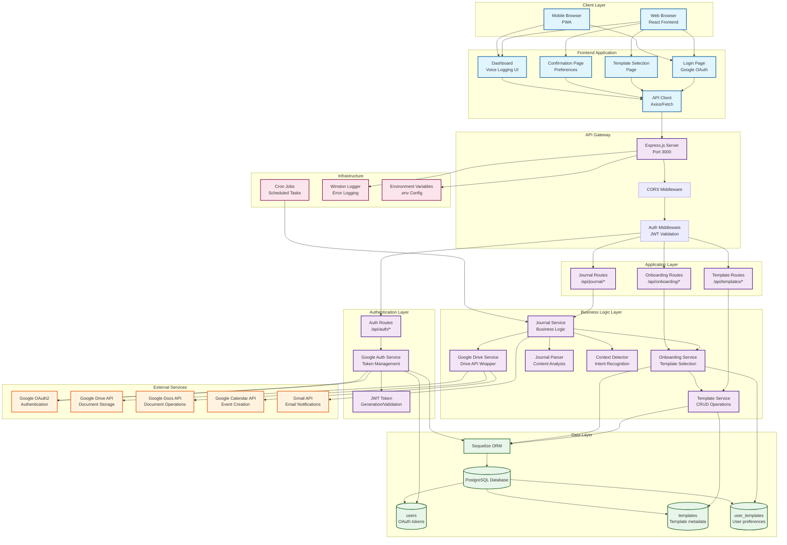

# GoOrderly.ai - Architecture Diagram

## Component Descriptions

### Client Layer
- **Web Browser**: Desktop/laptop users accessing via React web app
- **Mobile Browser**: Mobile users accessing via PWA

### Frontend Application
- **Login Page**: Google OAuth authentication entry point
- **Template Selection**: User chooses their journal template
- **Confirmation Page**: User reviews and sets preferences
- **Dashboard**: Main interface for voice logging and journal access
- **API Client**: Handles all HTTP requests to backend

### API Gateway
- **Express.js Server**: Main HTTP server handling all requests
- **CORS Middleware**: Enables cross-origin requests
- **Auth Middleware**: Validates JWT tokens for protected routes

### Authentication Layer
- **Auth Routes**: Handle OAuth flow and user sessions
- **Google Auth Service**: Manages OAuth token lifecycle
- **JWT**: Session token generation and validation

### Application Layer
- **Journal Routes**: CRUD operations for journals
- **Template Routes**: Template listing and details
- **Onboarding Routes**: Template selection and confirmation

### Business Logic Layer
- **Journal Service**: Core journaling logic
- **Template Service**: Template management
- **Onboarding Service**: User onboarding flow
- **Drive Service**: Google Drive API wrapper
- **Parser**: Analyzes journal content
- **Context Detector**: Detects intent from voice entries

### Data Layer
- **PostgreSQL**: Primary database
- **Sequelize ORM**: Database abstraction layer
- **Tables**: users, templates, user_templates

### External Services
- **Google APIs**: OAuth, Drive, Docs, Calendar, Gmail

### Infrastructure
- **Cron Jobs**: Scheduled journal creation
- **Logger**: Error and activity logging
- **Environment Variables**: Configuration management

