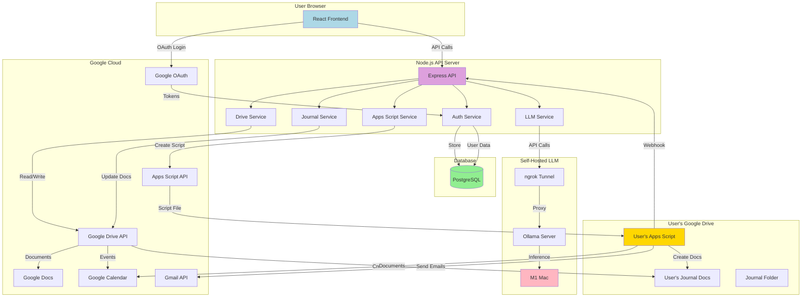
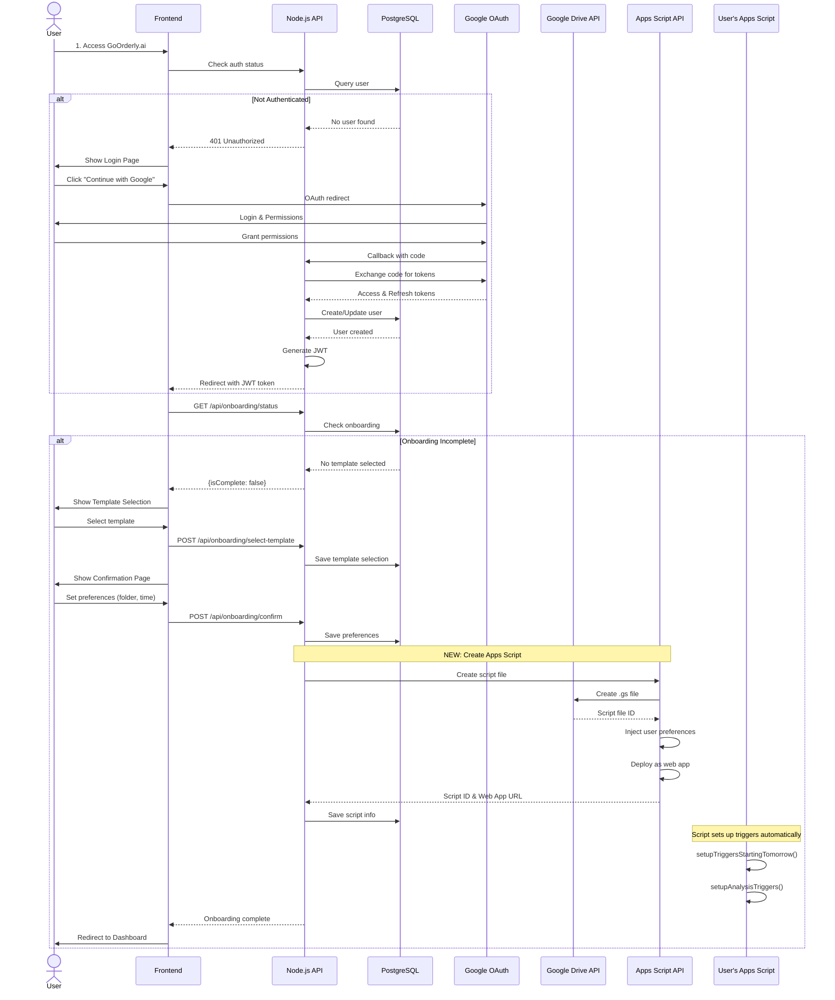
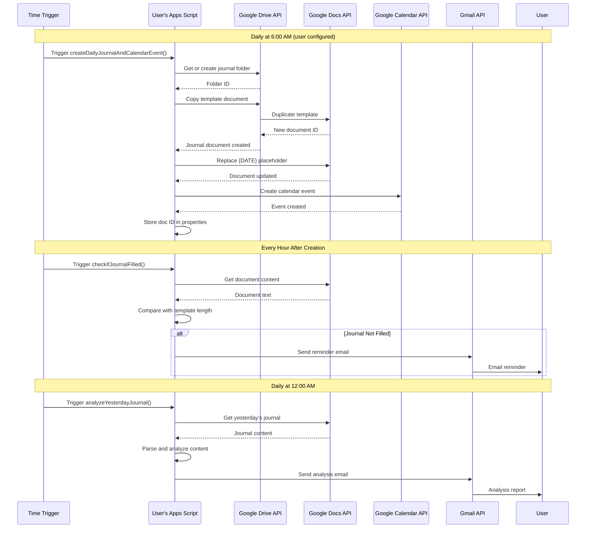
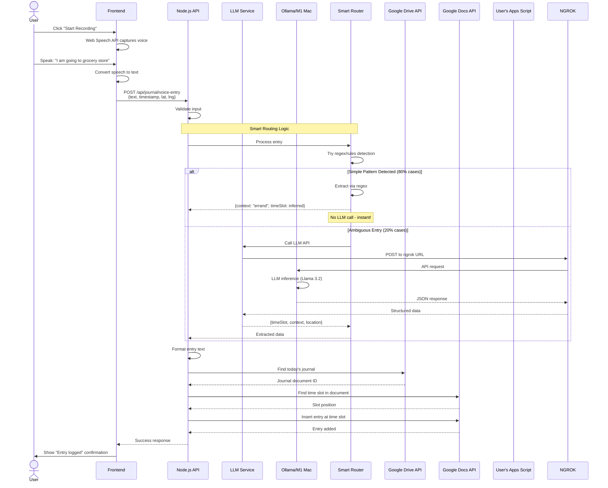
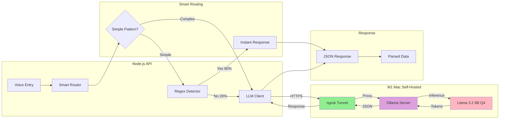
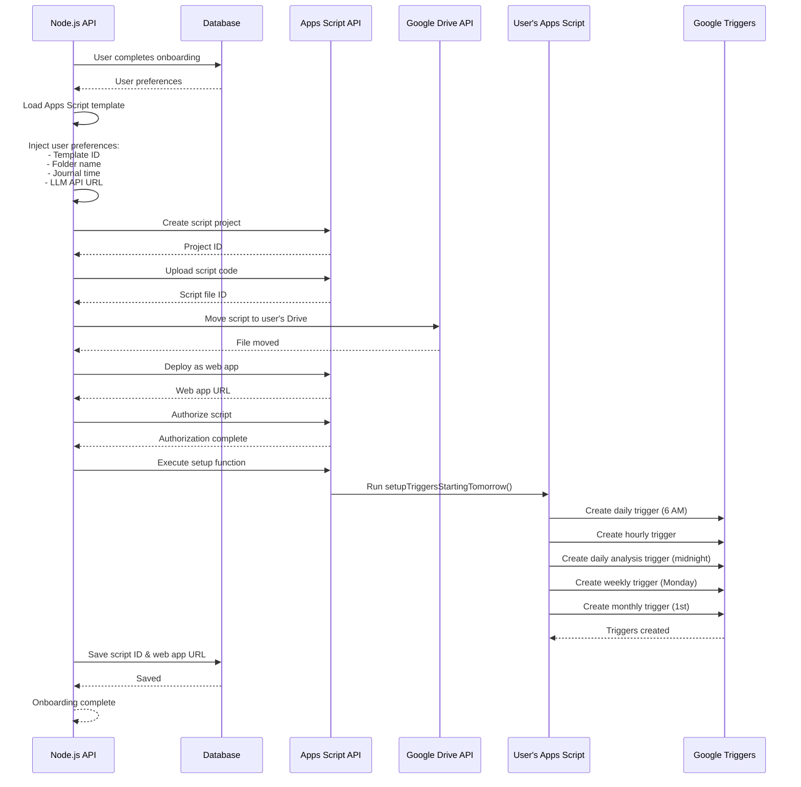
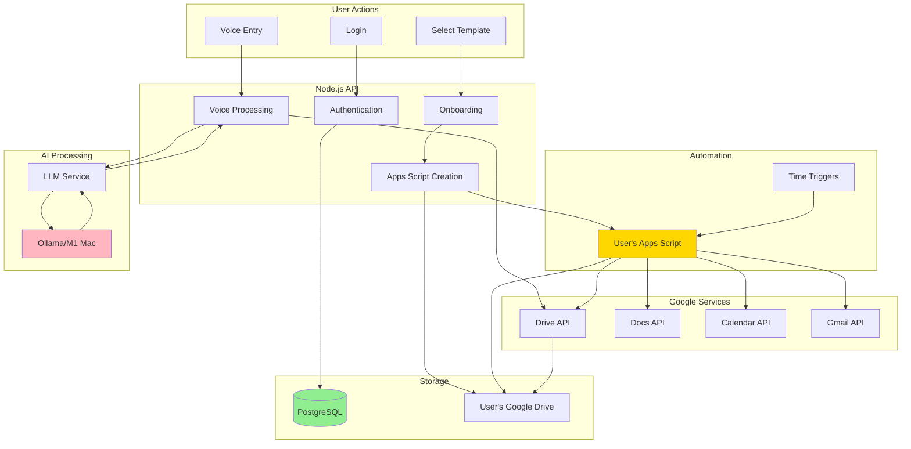

# GoOrderly.ai - Architecture Diagrams

## 1. System Architecture Overview

## 2. Onboarding Flow

## 3. Daily Automated Journal Creation (Apps Script)

## 4. Voice Entry Processing Flow

## 5. LLM Service Architecture

## 6. Apps Script Creation Process

## 7. Data Flow - Complete System

