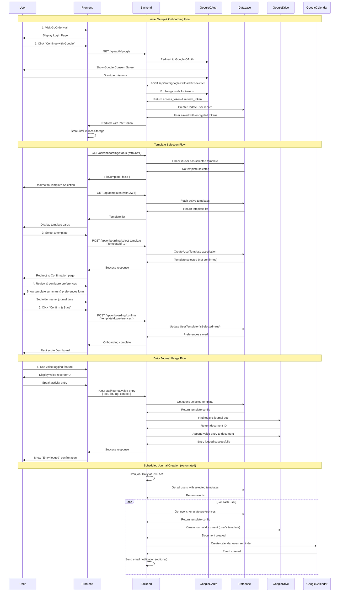

# GoOrderly.ai - User Workflow Diagram

```mermaid
sequenceDiagram
    participant User
    participant Frontend
    participant Backend
    participant GoogleOAuth
    participant Database
    participant GoogleDrive
    participant GoogleCalendar

    Note over User,GoogleCalendar: Initial Setup & Onboarding Flow
    
    User->>Frontend: 1. Visit GoOrderly.ai
    Frontend->>User: Display Login Page
    
    User->>Frontend: 2. Click "Continue with Google"
    Frontend->>Backend: GET /api/auth/google
    Backend->>GoogleOAuth: Redirect to Google OAuth
    GoogleOAuth->>User: Show Google Consent Screen
    User->>GoogleOAuth: Grant permissions
    GoogleOAuth->>Backend: POST /api/auth/google/callback?code=xxx
    Backend->>GoogleOAuth: Exchange code for tokens
    GoogleOAuth->>Backend: Return access_token & refresh_token
    Backend->>Database: Create/Update user record
    Database->>Backend: User saved with encrypted tokens
    Backend->>Frontend: Redirect with JWT token
    Frontend->>Frontend: Store JWT in localStorage
    
    Note over User,GoogleCalendar: Template Selection Flow
    
    Frontend->>Backend: GET /api/onboarding/status (with JWT)
    Backend->>Database: Check if user has selected template
    Database->>Backend: No template selected
    Backend->>Frontend: { isComplete: false }
    Frontend->>User: Redirect to Template Selection
    
    Frontend->>Backend: GET /api/templates (with JWT)
    Backend->>Database: Fetch active templates
    Database->>Backend: Return template list
    Backend->>Frontend: Template list
    Frontend->>User: Display template cards
    
    User->>Frontend: 3. Select a template
    Frontend->>Backend: POST /api/onboarding/select-template<br/>{ templateId: 1 }
    Backend->>Database: Create UserTemplate association
    Database->>Backend: Template selected (not confirmed)
    Backend->>Frontend: Success response
    Frontend->>User: Redirect to Confirmation page
    
    User->>Frontend: 4. Review & configure preferences
    Frontend->>User: Show template summary & preferences form
    User->>Frontend: Set folder name, journal time
    User->>Frontend: 5. Click "Confirm & Start"
    Frontend->>Backend: POST /api/onboarding/confirm<br/>{ templateId, preferences }
    Backend->>Database: Update UserTemplate (isSelected=true)
    Database->>Backend: Preferences saved
    Backend->>Frontend: Onboarding complete
    Frontend->>User: Redirect to Dashboard
    
    Note over User,GoogleCalendar: Daily Journal Usage Flow
    
    User->>Frontend: 6. Use voice logging feature
    Frontend->>User: Display voice recorder UI
    User->>Frontend: Speak activity entry
    Frontend->>Backend: POST /api/journal/voice-entry<br/>{ text, lat, lng, context }
    Backend->>Database: Get user's selected template
    Database->>Backend: Return template config
    Backend->>GoogleDrive: Find today's journal doc
    GoogleDrive->>Backend: Return document ID
    Backend->>GoogleDrive: Append voice entry to document
    GoogleDrive->>Backend: Entry logged successfully
    Backend->>Frontend: Success response
    Frontend->>User: Show "Entry logged" confirmation
    
    Note over User,GoogleCalendar: Scheduled Journal Creation (Automated)
    
    Backend->>Backend: Cron job: Daily at 6:00 AM
    Backend->>Database: Get all users with selected templates
    Database->>Backend: Return user list
    loop For each user
        Backend->>Database: Get user's template preferences
        Database->>Backend: Return template config
        Backend->>GoogleDrive: Create journal document (user's template)
        GoogleDrive->>Backend: Document created
        Backend->>GoogleCalendar: Create calendar event reminder
        GoogleCalendar->>Backend: Event created
        Backend->>Backend: Send email notification (optional)
    end
```

